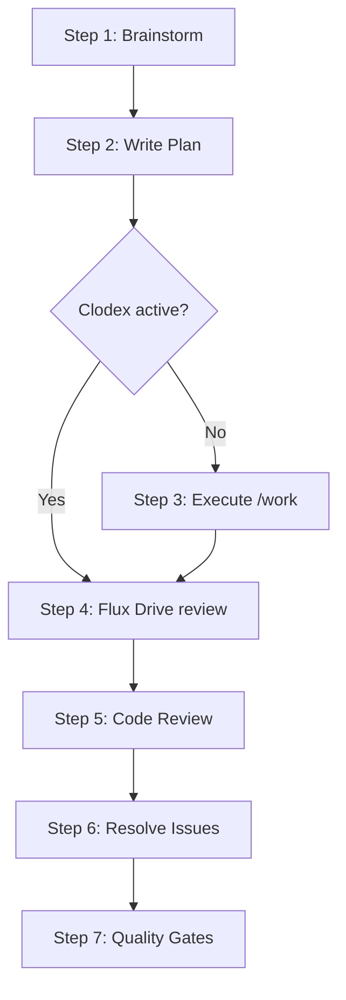

## Summary

Clavain v0.4.6 offers a comprehensive engineering workflow plugin with 27 commands, 34 skills, and 29 agents. The routing table in `using-clavain/SKILL.md` is structurally complete -- all 27 commands appear in the Quick Reference. However, the user experience suffers from three systemic problems: (1) cognitive overload from presenting all 27 commands with no progressive disclosure or tiered onboarding, (2) confusing near-duplicate command names (three `resolve-*` variants, two codex-first aliases), and (3) the `/lfg` pipeline lacks error recovery paths and has opaque conditional branching that silently skips steps based on hidden state. The `/setup` onboarding command is well-structured but its verification script is cosmetic rather than functional. Command help text quality is generally good, with each command having clear `argument-hint` and `description` fields, though the distinction between `/work` and `/execute-plan` remains unclear without reading their full bodies.

## Section-by-Section Review

### 1. Command Discoverability (using-clavain/SKILL.md)

**Routing Table Completeness:** The Quick Reference table at lines 130-158 lists all 27 commands with brief "When" descriptions. Every command file in `commands/*.md` has a corresponding entry. This is complete.

**Routing Table Structure:** The 3-layer routing system (Stage, Domain, Language) is conceptually sound -- it mirrors how engineers actually think about their work. However, it has structural issues:

- **Layer 1 (Stage)** is the primary routing mechanism, but the Execute row is overloaded. It contains 9 commands (`work`, `execute-plan`, `lfg`, `resolve-parallel`, `resolve-todo-parallel`, `resolve-pr-parallel`, `codex-first`, `clodex-toggle`, `debate`), while other rows contain 1-3 commands. This makes the Execute stage a dumping ground that defeats the purpose of routing. A new user looking at "I need to execute work" still has to parse 9 options.

- **Layer 2 (Domain)** does not mention commands at all -- only skills and agents. Commands like `setup`, `interpeer`, `debate`, `compound`, and `changelog` do not appear in either the stage or domain routing tables (they appear only in the Quick Reference). This means a user navigating the routing hierarchy systematically will never find these commands.

- The `plan-review` command appears in both the Plan stage and the Review stage (lines 37 and 41). While this makes conceptual sense (reviewing a plan is both planning and reviewing), it creates ambiguity -- a user in the "Plan" mindset and a user in the "Review" mindset will find the same command, which is fine, but neither the stage table nor the Quick Reference explains which context is primary.

- A separate "Review (docs)" stage (line 38) exists solely for `flux-drive`, which creates an 8th stage that breaks the otherwise clean 7-stage model. This could be folded into Review with a note about document vs. code review.

**Progressive Disclosure:** There is no tiered presentation. The routing table immediately presents all 34 skills, all 27 commands, and a suggestion to invoke skills for anything with "even a 1% chance." For a new user, this is overwhelming. There is no "start here" section, no "top 5 commands," no guided first run.

**Missing: Contextual Help.** There is no `/help` command that could suggest commands based on the current project state (e.g., "you have uncommitted changes -- consider `/review` or `/quality-gates`"). The routing heuristic (lines 88-95) is for the AI to follow internally, not for the user to see.

### 2. /lfg Pipeline UX

The `/lfg` command (at `/root/projects/Clavain/commands/lfg.md`) is the flagship autonomous pipeline: brainstorm, plan, execute, review, ship. It is 46 lines and covers 7 steps.

**Step Transitions:**
- Step 1 (brainstorm) and Step 2 (write-plan) chain cleanly via command invocations.
- Step 2-to-3 transition has a **clodex-mode fork** that checks for `.claude/autopilot.flag`. If clodex is active, Step 3 is silently skipped ("Skip this step -- `/write-plan` already executed via Codex Delegation"). This is correct behavior but poor UX: the user sees no indication that a step was skipped unless the AI decides to announce it. There is no explicit instruction to inform the user.
- Step 4 asks the AI to pass "the plan file path from Step 2" to flux-drive, which requires the AI to remember a file path across 3 steps of execution. This is fragile. If the AI loses track (e.g., after a context window compact), the pipeline breaks with no recovery path.
- Step 6 has another clodex-mode fork. The instructions say "if clodex is active, run `/resolve-todo-parallel`" and "if not active, run `/resolve-todo-parallel` normally" -- both branches run the same command, making the conditional pointless in the command file. The actual behavioral difference is embedded in the `resolve-todo-parallel` command itself (clodex-mode guidance), which is a leaky abstraction.

**Conditional Branching Clarity:** The clodex-mode forks at Steps 3 and 6 use a bash file-existence check (`[[ -f ... ]]`). This is an implementation detail that the user never sees. The user experience of `/lfg` depends entirely on whether a hidden flag file exists, with no upfront disclosure. A user who ran `/codex-first` in a previous session and forgot about it will get a very different `/lfg` experience with no explanation.

**Error Recovery:** There is no guidance for what happens when a step fails. If `/brainstorm` produces no output, does Step 2 proceed? If `/write-plan` fails to save a file, Step 4 will fail. If `/review` finds P1 blockers, does the pipeline stop? The command says "Run these steps in order. Do not do anything else." but gives no contingency instructions.

### 3. /setup Onboarding

The `/setup` command at `/root/projects/Clavain/commands/setup.md` is a 7-step onboarding wizard. It covers:
- Plugin self-verification (Step 1)
- Required plugin installation (Step 2) -- 9 plugins from 2 marketplaces
- Conflict resolution (Step 3) -- 8 plugins to disable
- MCP server verification (Step 4) -- 3 servers
- Beads initialization (Step 5)
- Verification (Step 6)
- Summary (Step 7)

**Strengths:**
- Good use of `AskUserQuestion` for language server selection (interactive, not assumed).
- Clear separation of required vs. recommended vs. conditional plugins.
- Final summary includes actionable "next steps."

**Weaknesses:**
- **Verification is cosmetic.** Step 6 runs shell loops that echo "checking..." and "should be disabled" but never actually verify. The `for plugin in ... do echo "$plugin: checking..."` loop does not call `claude plugin list` or any verification command. It just prints status strings.
- **No `--check-only` implementation detail.** The `argument-hint` mentions `--check-only` mode but the command body never branches on it beyond a single line at the top ("If `--check-only` is in the arguments, only verify the configuration -- do not make changes"). The verification step (Step 6) is identical regardless of mode.
- **No error handling for failed plugin installs.** If `claude plugin install context7@claude-plugins-official` fails, there is no retry logic or fallback instruction.
- **No prerequisite check.** The command assumes `gh` and `curl` are available but never verifies. If `curl` is missing, the MCP server checks will fail silently.

### 4. Command Naming

**Intuitive names:**
- `brainstorm`, `review`, `work`, `setup`, `changelog` -- immediately clear what they do.
- `write-plan`, `execute-plan` -- verb-noun pattern is consistent.
- `flux-drive` -- memorable brand name, though opaque to new users (what is a "flux drive"?).

**Confusing names:**
- **`resolve-parallel`, `resolve-todo-parallel`, `resolve-pr-parallel`:** Three commands that all resolve things in parallel but differ in their source (TODO comments, CLI todos, PR comments). The naming pattern suggests they are variations of the same command, but their sources are completely different. A user who wants to "resolve issues" must understand the taxonomy of issue sources before picking the right command.
- **`codex-first` and `clodex-toggle`:** Two command files that do exactly the same thing. The `clodex-toggle` file explicitly says "This is an alias for `/codex-first`." Two separate command entries in the Quick Reference table waste cognitive space. The portmanteau "clodex" (Claude + Codex) is not explained anywhere in the Quick Reference.
- **`compound`:** Opaque name. "Capture solved problem as documentation" is only clear after reading the description. The name alone evokes "compound interest" or "compound word" -- not documentation.
- **`lfg`:** Internet slang ("Let's [expletive] Go") that is culturally specific and unprofessional in some contexts. The Quick Reference describes it as "Full autonomous workflow" which helps, but the name itself is opaque.
- **`triage`:** Good name, but the description "Triage and categorize findings for the CLI todo system" mentions "CLI todo system" which is Clavain-internal jargon. A new user does not know what the "CLI todo system" is.

**Opaque names:**
- `flux-drive`: Requires reading the description to understand. No inherent meaning.
- `interpeer`: The "inter" prefix suggests inter-process or inter-system. Without context, "peer review between AI peers" is not obvious.
- `heal-skill`: "Heal" is an unusual verb for "fix." Most developers would expect "fix-skill" or "repair-skill."
- `agent-native-audit`: Jargon-heavy. "Agent-native architecture" is a concept only familiar to users who have read the `agent-native-architecture` skill.

### 5. Help Text Quality

Each command has YAML frontmatter with `name`, `description`, and usually `argument-hint`. These serve as the inline help text when users see the command list.

**Good descriptions:**
- `brainstorm`: "Structured brainstorm workflow -- 4 phases (assess clarity, research repo, explore approaches, capture design) with auto-handoff to /write-plan" -- tells you the structure and what happens next.
- `repro-first-debugging`: "Disciplined bug investigation that enforces 'reproduce first, then diagnose'" -- clear methodology statement.
- `quality-gates`: "Auto-select and run the right reviewer agents based on what changed" -- describes the value proposition.

**Weak descriptions:**
- `flux-drive`: "Intelligent document review -- triages relevant agents, launches only what matters in background mode" -- uses internal jargon ("triages agents"). A user who does not know what "agent triage" means will not understand this.
- `triage`: "Triage and categorize findings for the CLI todo system" -- circular (triage triages) and references internal system.
- `compound`: "Document a recently solved problem to compound your team's knowledge" -- the description is better than the name, but "compound knowledge" is an unusual phrase.
- `clodex-toggle`: "Toggle codex-first execution mode -- all code changes go through Codex agents (alias for /codex-first)" -- correctly identifies alias status, but if it is an alias, why does it exist as a separate command?

**Descriptions vs. Reality:**
- `/work` says "Execute work plans efficiently while maintaining quality and finishing features." The command body adds a comparison note vs. `/execute-plan`, but this distinction ("autonomous feature shipping" vs. "batch execution with architect review checkpoints") does not appear in the routing table or Quick Reference. Users must read the full command body to understand the difference.
- `/lfg` says "Full autonomous engineering workflow -- brainstorm, plan, execute, review, ship." This accurately describes the pipeline, but does not mention the clodex-mode branching that significantly changes the pipeline behavior.

### 6. Error Recovery in Pipeline Steps

**`/lfg` pipeline:** No error recovery. The command is 46 lines of "do these steps in order" with no `if X fails, then Y` branching.

**`/work` command:** Better -- Phase 1 says "If anything is unclear or ambiguous, ask clarifying questions now." Step 3 in Phase 2 says "Fix failures immediately." The "When to Stop and Ask for Help" section (not present in `/lfg`) gives clear stopping conditions. But there is no guidance on rolling back partial work.

**`/setup` command:** No error handling for failed installs. If a marketplace is unreachable, the command will fail silently.

**`/review` command:** Phase 3.5 (Oracle) has explicit error handling: "If Oracle is not available, skip." This is a good pattern.

**`/flux-drive` skill:** Excellent error handling. Step 2.3 has path resolution fallbacks, retry logic for failed Codex dispatches, and explicit "fall back to Task dispatch" instructions. This is the gold standard in the plugin.

### 7. Formatting and Structural Issues

**`/work` command (line 190):** Numbering jumps from step 2 ("Commit and Push") to step 4 ("Notify User"). Step 3 is missing. This suggests content was removed without renumbering.

**`/triage` command:** The markdown has a broken code fence. The "Final Summary" section at the end has a code block that opens with triple backticks but the subsequent "2. Start work on approved items" text appears outside the code block, followed by another code block. The nesting is broken from approximately line 200 onward, making the rendered markdown confusing.

**`/changelog` command:** Uses emojis extensively in the template output (rocket, star, bug, tools, hands, tada) which conflicts with the plugin's otherwise professional tone. This is a stylistic inconsistency rather than a bug.

## Issues Found

### P1-1: Execute Stage Overload
**Severity:** P1
**Location:** `/root/projects/Clavain/skills/using-clavain/SKILL.md`, line 39
**Description:** The Execute row in the Layer 1 routing table contains 9 commands, making it the largest stage by a factor of 3x. This defeats the purpose of stage-based routing -- a user who identifies they are in the "Execute" stage still faces a 9-way choice. Commands like `codex-first`, `clodex-toggle`, and `debate` are mode toggles and discussion tools, not execution commands, and should be categorized elsewhere or grouped into a sub-category.

### P1-2: Silent Step Skipping in /lfg
**Severity:** P1
**Location:** `/root/projects/Clavain/commands/lfg.md`, lines 19-27
**Description:** When clodex mode is active, Step 3 (Execute) is silently skipped. The command tells the AI to check a file flag but does not instruct it to inform the user that a step was bypassed. A user watching `/lfg` progress will see it jump from planning to review with no explanation, creating confusion about whether work was actually done.

### P1-3: Three resolve-* Commands Are Indistinguishable
**Severity:** P1
**Location:** `/root/projects/Clavain/commands/resolve-{parallel,todo-parallel,pr-parallel}.md`
**Description:** The three commands resolve different sources (codebase TODO comments, CLI todo files in `todos/*.md`, PR comments) but their names give no clue about the source distinction. All three say "resolve [something] in parallel." Users must memorize which suffix maps to which source, and the routing table lists all three in the Execute stage without guidance on when to use which.

### P1-4: No Error Recovery in /lfg Pipeline
**Severity:** P1
**Location:** `/root/projects/Clavain/commands/lfg.md`
**Description:** The /lfg command is a 7-step sequential pipeline with no failure handling. If Step 1 (brainstorm) produces empty output, Step 2 will proceed with no input. If Step 2 fails to write a plan file, Step 4 will fail trying to pass the file path to flux-drive. If Step 5 (review) finds P1 blockers, the pipeline proceeds to Step 6 anyway. There is no "stop on failure" instruction, no retry guidance, and no "resume from step N" capability.

### P2-1: plan-review in Two Stages
**Severity:** P2
**Location:** `/root/projects/Clavain/skills/using-clavain/SKILL.md`, lines 37 and 41
**Description:** The `plan-review` command appears in both the Plan stage and the Review stage routing table rows. While this dual placement makes conceptual sense, it creates routing ambiguity. A disambiguation note (e.g., "Use during Plan stage for pre-implementation review; use during Review stage for post-implementation plan audit") would clarify intent.

### P2-2: Redundant Alias Commands
**Severity:** P2
**Location:** `/root/projects/Clavain/commands/codex-first.md`, `/root/projects/Clavain/commands/clodex-toggle.md`
**Description:** `clodex-toggle` is explicitly documented as "an alias for `/codex-first`." Having two separate command files, two routing table entries, and two Quick Reference rows for the same functionality adds noise without adding discoverability. The `clodex-toggle.md` file is 6 lines that say "follow codex-first."

### P2-3: Setup Verification Is Cosmetic
**Severity:** P2
**Location:** `/root/projects/Clavain/commands/setup.md`, lines 104-126 (Step 6)
**Description:** The verification script in Step 6 iterates over plugin names and prints "checking..." but never actually checks anything. The `for plugin in ... do echo "$plugin: checking..."` loop should call `claude plugin list` or use filesystem checks to verify installation status. Currently, Step 6 will always appear to succeed.

### P2-4: Commands Missing from Stage/Domain Routing
**Severity:** P2
**Location:** `/root/projects/Clavain/skills/using-clavain/SKILL.md`, Layer 1 and Layer 2 tables
**Description:** Several commands appear only in the Quick Reference but not in either routing table: `setup`, `interpeer`, `debate` (appears only in Execute stage, but is more of a meta/decision-making tool), `compound` (Ship stage would be natural), and `flux-drive` (has its own special "Review (docs)" row but is not in the Domain table under Docs). While the Quick Reference is complete, the routing tables -- which are the primary navigation mechanism -- have gaps. The `compound` command is particularly orphaned: it captures post-fix knowledge, naturally belonging in Ship stage, but is absent from that row.

### P2-5: /lfg Step 4 Uses flux-drive for Plan Review
**Severity:** P2
**Location:** `/root/projects/Clavain/commands/lfg.md`, line 30
**Description:** Step 4 of `/lfg` passes the plan file to `/flux-drive`, which is a general-purpose document/repo reviewer. This is intentional but creates a UX confusion: the next step (Step 5) runs `/review` for code review. The distinction between "reviewing the plan document" (Step 4) and "reviewing the code changes" (Step 5) is implicit. Step 4 should include a brief note like "This reviews the plan document for completeness; Step 5 reviews the code for correctness."

### P2-6: work vs. execute-plan Distinction Unclear
**Severity:** P2
**Location:** Quick Reference at lines 135-136 of using-clavain SKILL.md
**Description:** `/work [plan]` says "Execute a plan" and `/execute-plan [plan]` says "Execute plan in separate session with checkpoints." The key distinction -- autonomous shipping vs. batched checkpoints -- is buried in the command bodies. The Quick Reference descriptions are too similar. The `execute-plan` command body has a helpful comparison note ("When to use this vs `/work`") but this note does not surface in the routing table.

### P2-7: No Progressive Onboarding
**Severity:** P2
**Location:** `/root/projects/Clavain/skills/using-clavain/SKILL.md`
**Description:** The using-clavain skill is injected at every session start. A first-time user sees the full 3-layer routing table, all 27 commands, and strongly-worded imperatives ("THIS IS NOT NEGOTIABLE"). There is no "new to Clavain?" section that introduces the 4-5 essential commands (`/lfg`, `/brainstorm`, `/review`, `/setup`, `/work`) before presenting the full catalog. The `/setup` command exists but is listed 26th in the Quick Reference, not prominently featured.

### P2-8: Missing Step in /work Command
**Severity:** P2
**Location:** `/root/projects/Clavain/commands/work.md`, lines 162-194 (Phase 4)
**Description:** Phase 4 "Ship It" has steps numbered 1, 2, and 4. Step 3 is missing. The content jumps from "Commit and Push" (step 2) to "Notify User" (step 4). This appears to be a copy-paste artifact where step 3 was deleted without renumbering.

### P2-9: Broken Markdown in /triage Command
**Severity:** P2
**Location:** `/root/projects/Clavain/commands/triage.md`, lines 196-310
**Description:** The "Final Summary" section has improperly nested code fences. A four-backtick fence opens at line 172 but subsequent content at lines 202-209 appears to be outside the code block with its own triple-backtick fences. The resulting rendered markdown will show raw markdown syntax to the AI, potentially causing misinterpretation of the triage instructions.

### P2-10: Review (docs) Stage Creates Awkward 8th Stage
**Severity:** P2
**Location:** `/root/projects/Clavain/skills/using-clavain/SKILL.md`, line 38
**Description:** The routing table has 7 conceptual stages (Explore, Plan, Execute, Debug, Review, Ship, Meta) but inserts "Review (docs)" between Plan and Execute, creating an 8th row. This breaks the mental model because "Review (docs)" and "Review" (code) look like the same category split into two rows. Merging them into a single "Review" row with sub-categories (code review, document review) would be cleaner.

## Improvements Suggested

### IMP-1: Getting Started Section
Add a "Getting Started" block at the top of the Quick Reference that highlights 5 essential commands for new users:
```
## Quick Start (New to Clavain?)

1. `/clavain:setup` — Install everything (run once)
2. `/clavain:lfg [task]` — Full autonomous pipeline
3. `/clavain:brainstorm [idea]` — Explore before building
4. `/clavain:review` — Multi-agent code review
5. `/clavain:work [plan]` — Execute a plan

For everything else, see the full routing table below.
```

### IMP-2: Consolidate resolve-* Commands
Replace the three `resolve-*` commands with a single `/resolve` command that accepts a mode flag or auto-detects the source:
- `/clavain:resolve todos` -- resolves CLI todo files
- `/clavain:resolve pr` -- resolves PR comments
- `/clavain:resolve code` -- resolves inline TODO comments
Or at minimum, rename them to make the source explicit: `resolve-code-todos`, `resolve-file-todos`, `resolve-pr-comments`.

### IMP-3: Add Error Recovery to /lfg
Add a "Step Failure Recovery" section to the `/lfg` command:
```
## Error Recovery

If any step fails:
- Steps 1-2 (brainstorm/plan): Retry the step. If persistent, ask the user for clarification.
- Step 3 (execute): Use `/work` with the plan file directly.
- Steps 4-5 (review): Skip if non-critical; present findings and ask user whether to proceed.
- Step 6 (resolve): Run manually with `/resolve-todo-parallel`.
- Step 7 (quality): Always run. If it fails, do NOT ship.

To resume from a specific step: Invoke the individual command directly.
```

### IMP-4: Make /setup Verification Functional
Replace the cosmetic echo loops in Step 6 with actual checks:
```bash
# Check installed plugins
claude plugin list 2>/dev/null | grep -q "clavain" && echo "clavain: OK" || echo "clavain: MISSING"
```
If `claude plugin list` is not available in the Bash context, use filesystem checks against the plugin cache directory.

### IMP-5: Short Aliases
Consider adding short aliases for the most common commands. Claude Code plugins support this via additional `name` entries. This would improve keyboard ergonomics:
- `/clavain:r` for `/clavain:review`
- `/clavain:b` for `/clavain:brainstorm`
- `/clavain:qg` for `/clavain:quality-gates`

### IMP-6: Contextual /help Command
Create a `/clavain:help` command that examines git status, current branch, and recent conversation to suggest relevant commands. Example output: "You have 12 uncommitted changes across 4 files. Consider: `/review` for code review, `/quality-gates` for automated checks, or `/changelog` to document what changed."

### IMP-7: Merge codex-first and clodex-toggle
Keep `codex-first` as the canonical command. Remove `clodex-toggle.md` as a separate file. Instead, add a line to `codex-first.md`: "Alias: Also invokable as `/clavain:clodex-toggle` or `/clavain:clodex`." This reduces the command count by 1 and eliminates a routing table entry that adds no information.

### IMP-8: Split Execute Stage in Routing Table
Break the Execute stage into sub-rows:
```
| **Execute (autonomous)** | executing-plans, clodex | work, execute-plan, lfg |
| **Execute (parallel)** | dispatching-parallel-agents, subagent-driven-development | resolve-parallel, resolve-todo-parallel, resolve-pr-parallel |
| **Execute (mode)** | — | codex-first, clodex-toggle, debate |
```
This reduces cognitive load from 9 commands in one row to 3 rows of 2-3 commands each.

### IMP-9: Pipeline Flow Diagram
Add a Mermaid diagram to the `/lfg` command showing the pipeline flow with conditional branches:


## Overall Assessment

Clavain's CLI UX is functional for experienced users who have internalized the command taxonomy, but presents a steep learning curve for newcomers. The routing table is architecturally sound (stage/domain/language layering is intuitive) but undermined by overloaded rows and missing entries. The `/lfg` flagship pipeline works end-to-end but lacks the resilience expected of an autonomous workflow -- silent step-skipping and zero error recovery make it fragile. The `/setup` command demonstrates good onboarding intent but its verification step is a facade. Command naming is a mixed bag: core workflow commands (`brainstorm`, `review`, `work`) are excellent, while specialized commands (`compound`, `lfg`, `flux-drive`, `interpeer`) require domain knowledge to parse. The plugin would benefit most from progressive disclosure (a "Getting Started" section), error recovery in `/lfg`, and consolidation of near-duplicate commands.
