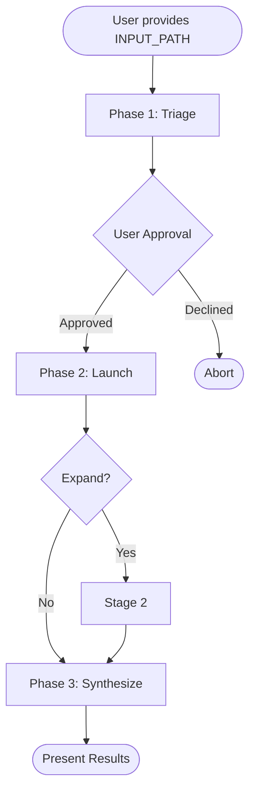

# flux-drive Protocol Specification - Architecture Review

**Reviewed:** 2026-02-14
**Reviewer:** Flux-Drive Architecture & Design Reviewer
**Spec Version:** 1.0.0
**Documents Reviewed:** 9 (README + 4 core + 2 contracts + 2 extensions)

---

## Findings Index

| SEVERITY | ID | "Section" | Title |
|----------|----|-----------:|-------|
| P2 | AR-001 | "Cross-References" | Inconsistent reference format across documents |
| P2 | AR-002 | "Core/Extension Split" | Domain detection appears in both core and extension contexts |
| P1 | AR-003 | "Conformance Levels" | Overlapping requirements between Core and Core+Domains conformance |
| P2 | AR-004 | "Abstraction Level" | Implementation details leak into protocol.md phase diagrams |
| P3 | AR-005 | "Document Structure" | Missing conformance section in completion-signal.md follows different pattern |
| P2 | AR-006 | "Circular Dependencies" | Synthesis depends on slicing.md which isn't in the spec directory |
| P1 | AR-007 | "Cross-References" | Dead reference to shared-contracts.md in multiple documents |

Verdict: needs-changes

---

## 1. Boundaries & Coupling

### 1.1 Core vs Extension Separation

**Architecture Decision:** The spec separates required protocol elements (core/) from optional enhancements (extensions/). This is sound.

**Issue:** Domain detection appears in multiple contexts with unclear boundaries:
- `core/protocol.md` Phase 1 Step 2 says "Classify Project Domain" and references `extensions/domain-detection.md`
- `core/scoring.md` includes "domain_boost" as part of the base scoring formula (0-7 scale)
- README conformance level "Core" requires "at least base_score and slot ceiling" but doesn't mention domain_boost
- Conformance level "Core + Domains" adds domain detection

**Finding AR-002:** The scoring formula `base_score + domain_boost + project_bonus + domain_agent_bonus` treats domain_boost as a peer component, not an optional extension. This creates tension: implementations claiming "Core" conformance must either:
1. Implement domain_boost (making it not really optional)
2. Skip it (breaking the 0-7 scale expectation in scoring.md)

**Recommendation:** Either move domain_boost to extensions/scoring-with-domains.md and make core scoring 0-5 (base + project + domain_agent), OR elevate domain detection to core and remove "Core + Domains" as a separate conformance level.

### 1.2 Contract Boundaries

**Strengths:**
- contracts/findings-index.md is a clean interface contract with no implementation leakage
- contracts/completion-signal.md defines the agent↔orchestrator protocol independently
- Both contracts are referenced correctly from core documents (protocol.md, synthesis.md)

**Issue AR-007:** Multiple documents reference `shared-contracts.md`:
- `staging.md` line 29: "Completion Signal contract (defined in `shared-contracts.md`)"
- `staging.md` line 228: "Monitoring contract: `skills/flux-drive/phases/shared-contracts.md`"
- `completion-signal.md` line 93: "Contract is defined in `skills/flux-drive/phases/shared-contracts.md`"

This file does not exist in `docs/spec/contracts/`. It appears to be an Interflux implementation file that leaked into the specification. The contract content is duplicated in `contracts/completion-signal.md` and `contracts/findings-index.md`.

**Recommendation:** Global search-replace to remove `shared-contracts.md` references. Point to the actual contract documents (completion-signal.md, findings-index.md) instead.

### 1.3 Dependency Direction

**Correct flow:**
- contracts/ ← core/ ← extensions/ (extensions depend on core, core depends on contracts)
- No upward dependencies detected

**Issue AR-006:** `synthesis.md` line 348 references `skills/flux-drive/phases/slicing.md`:
```
Convergence adjustment: `skills/flux-drive/phases/slicing.md` (synthesis contracts section)
```

This creates a dependency from core/synthesis.md → (implementation file slicing.md). The content routing/slicing algorithm is described in `protocol.md` Phase 2 Step 3, but convergence adjustment rules are not in the spec — they're in the implementation.

**Recommendation:** Either extract slicing content-routing rules into `core/protocol.md` (expand Step 3 with convergence adjustment notes), OR remove the reference and document convergence adjustment inline in `synthesis.md` Step 4.

---

## 2. Pattern Analysis

### 2.1 Conformance Pattern Consistency

**Observation:** All 6 core+contract docs end with a "Conformance" section using MUST/SHOULD/MAY/MUST NOT. This is excellent — RFC 2119 style provides clear implementation guidance.

**Issue AR-005:** `contracts/completion-signal.md` breaks the pattern slightly:
- Other docs have subsections (e.g., scoring.md has "### MUST", "### SHOULD", "### MAY", "### MUST NOT")
- completion-signal.md uses a flat list with bolded labels ("**MUST**", "**SHOULD**")

Not a functional issue, but reduces consistency.

**Recommendation:** Standardize on the subsection pattern across all conformance blocks.

### 2.2 Cross-Reference Format

**Issue AR-001:** Three reference formats are used inconsistently:

1. **Relative markdown links:** `[core/protocol.md](core/protocol.md)` (README)
2. **Inline parenthetical:** `(see core/staging.md)` (protocol.md line 303)
3. **Bare filenames:** "See `contracts/findings-index.md` for format spec." (synthesis.md line 52)

**Examples:**
- README line 29: `[core/protocol.md](core/protocol.md)` ✓ clickable
- protocol.md line 141: "See [core/scoring.md](./scoring.md) for full algorithm." ✓ clickable
- staging.md line 76: "The map encodes which domain combinations actually co-occur" — references adjacency map but no link
- synthesis.md line 52: "Reference: `contracts/findings-index.md`" — not clickable

**Recommendation:** Standardize on markdown links with relative paths. Pattern: `[section name](./path/to/doc.md)` or `[section name](../path/to/doc.md)` depending on directory depth.

### 2.3 Interflux Reference Sections

**Strengths:**
- Every core document includes an "Interflux Reference" section clearly marked as implementation-specific
- This boundary is architecturally sound — spec defines protocol, reference shows one way to implement it
- Prevents conflation of "how flux-drive works" vs "how Interflux implements flux-drive"

**Minor issue:** Some references are file paths (good for developers) but not URLs (limits external implementers). Not a P1 issue since this is "reference" not "required reading."

---

## 3. Simplicity & YAGNI

### 3.1 Conformance Level Granularity

**Issue AR-003:** Three conformance levels are defined:
1. Core
2. Core + Domains
3. Core + Knowledge

**Overlap concern:** The README says Core conformance requires:
- "Agent scoring with at least base_score and slot ceiling"

But `scoring.md` defines scoring as:
```
final_score = base_score + domain_boost + project_bonus + domain_agent_bonus
```

An implementation claiming "Core" conformance that skips domain_boost still gets project_bonus and domain_agent_bonus (both reference domain detection in their semantics). This creates ambiguity:
- Can a "Core" implementation skip all three bonuses and only use base_score?
- Or must it implement project_bonus + domain_agent_bonus but skip domain_boost?

**Recommendation:** Clarify README conformance level "Core" requirements. Options:
1. "Core implementations MUST implement base_score (0-3). MAY implement bonuses but total score range is implementation-defined."
2. OR: "Core implementations MUST implement base_score + project_bonus (0-4 range). Domain components are optional."

This removes the ambiguity about what "at least base_score" means.

### 3.2 Abstraction Level Consistency

**Issue AR-004:** `protocol.md` includes highly detailed mermaid flowcharts (lines 506-547) showing internal orchestrator state transitions like:
```
Gate -->|Edit| T4
Gate -->|Reject| Abort([Abort])
```

These are implementation details (what buttons does the orchestrator UI present?) leaking into the protocol specification. The protocol should define:
- WHAT must happen (user approval gate exists)
- WHEN it happens (after scoring, before dispatch)
- NOT how it's implemented (3-option choice with "Edit" leading back to Step 4)

**Contrast:** The expansion decision in `staging.md` does it correctly:
- Defines thresholds (≥3, 2, ≤1) — protocol requirement
- Defines presentation format — protocol requirement
- Leaves UI implementation unspecified

**Recommendation:** Move detailed flowcharts to an appendix or Interflux Reference section. Keep the core protocol description at the abstraction level of "orchestrator presents options, user chooses."

### 3.3 Unnecessary Duplication

**Observation:** No significant duplication detected. Each document has a clear, non-overlapping scope:
- `protocol.md` — phase lifecycle
- `scoring.md` — agent selection algorithm
- `staging.md` — stage dispatch logic
- `synthesis.md` — findings aggregation

Cross-references are appropriate and avoid copy-paste.

---

## 4. Circular Dependencies

**Analysis:** Document dependency graph:

```
README
  ↓
core/protocol.md → contracts/findings-index.md
                 → contracts/completion-signal.md
                 → core/scoring.md
                 → core/staging.md
                 → core/synthesis.md
                 → extensions/domain-detection.md

core/scoring.md → extensions/domain-detection.md

core/staging.md → contracts/completion-signal.md

core/synthesis.md → contracts/findings-index.md
                  → contracts/completion-signal.md

extensions/knowledge-lifecycle.md → (no internal refs)
extensions/domain-detection.md → core/scoring.md
```

**Finding:** One potential cycle:
- `core/scoring.md` references `extensions/domain-detection.md` for domain boost calculation
- `extensions/domain-detection.md` line 136 references `core/scoring.md` for integration details

This is a weak cycle (both documents can be read independently), but it's worth noting.

**Recommendation:** Break the cycle by moving integration details from domain-detection.md into scoring.md's existing "Domain Boost" section. domain-detection.md should only define signal detection, not scoring integration.

---

## 5. Abstraction Level Leaks

### 5.1 File Paths in Protocol

**Issue:** Several protocol documents reference Interflux file paths directly in the algorithm descriptions (not just "Interflux Reference" sections):

- `protocol.md` line 74: "`${OUTPUT_DIR}/domain-detection.json`" — this is an implementation detail (cache location)
- `protocol.md` line 93: "`${OUTPUT_DIR}/input-profile.json`" — ditto
- `staging.md` line 213: "Implementation Locations: `skills/flux-drive/phases/launch.md` (lines 146-220)" — this is in the main spec body, not "Interflux Reference"

**Recommendation:** Move all `${OUTPUT_DIR}` references to the Interflux Reference sections. The protocol should describe caching conceptually ("detection results MAY be cached in the project directory") without specifying file formats or paths.

### 5.2 Mermaid Diagrams

**Strength:** All three phase diagrams (triage, launch, synthesize) in `protocol.md` use consistent flowchart syntax and abstraction level.

**Issue (AR-004 revisited):** The lifecycle diagram lines 506-547 includes UI state like:
```
Gate -->|Edit| T4
Gate -->|Reject| Abort
```

These are UX decisions, not protocol requirements.

**Recommendation:** Simplify the lifecycle diagram to show only phase transitions (Triage → Launch → Synthesize) with decision points abstracted ("User Approval Gate" as a single node, not 3 outbound edges).

---

## 6. Versioning & Future Compatibility

**Strengths:**
- Semantic versioning defined clearly (README line 80-84)
- Spec version independent of implementation version (Interflux)
- Conformance levels allow incremental adoption

**Observation:** No extension points or hook mechanisms are defined. If a future implementation wants to add a new conformance level (e.g., "Core + Continuous Learning"), they would need to:
1. Fork the spec, OR
2. Propose a minor version bump (1.1) with a new extension

This is acceptable for a 1.0 spec, but worth documenting in a "Future Extensions" appendix.

---

## Summary

### Architecture Verdict

**needs-changes** — 2 P1 issues require resolution before the spec is production-ready:

1. **AR-003:** Conformance level overlap between Core and Core+Domains creates ambiguity about required scoring components
2. **AR-007:** Dead references to shared-contracts.md break spec self-containment

### Strengths

1. **Clean contract boundaries:** findings-index.md and completion-signal.md are well-isolated interface specifications
2. **Clear core/extension split:** The three-tier conformance model (Core, Core+Domains, Core+Knowledge) is architecturally sound (pending clarification of AR-003)
3. **No circular dependencies:** Document structure is acyclic (one weak cycle in scoring ↔ domain-detection, easily resolved)
4. **Consistent conformance pattern:** RFC 2119 MUST/SHOULD/MAY usage across all documents
5. **Implementation separation:** Interflux Reference sections cleanly separate protocol from implementation

### Weaknesses

1. **Cross-reference consistency:** Three different formats make navigation harder
2. **Abstraction level drift:** Some protocol documents include implementation details (file paths, UI flows)
3. **Missing file references:** shared-contracts.md and slicing.md are referenced but not in spec/
4. **Conformance granularity:** Core conformance requirements need tighter definition

### Recommendations (Priority Order)

1. **Fix AR-007 (P1):** Remove all references to shared-contracts.md. Point to completion-signal.md and findings-index.md directly.
2. **Fix AR-003 (P1):** Clarify Core conformance scoring requirements in README. Specify which bonuses are required vs optional.
3. **Fix AR-006 (P2):** Either add slicing.md content to the spec or remove the reference and inline convergence adjustment rules in synthesis.md.
4. **Fix AR-002 (P2):** Resolve domain_boost's position in the scoring formula. Either make it core or clearly mark it optional with a fallback.
5. **Fix AR-001 (P2):** Standardize on markdown link format for all cross-references.
6. **Fix AR-004 (P2):** Move implementation-level flowcharts to appendices or Interflux Reference sections.

---

## Detailed Findings

### AR-001: Inconsistent Cross-Reference Format (P2 — "Cross-References")

**Evidence:**
- README uses `[core/protocol.md](core/protocol.md)`
- protocol.md mixes `(see core/staging.md)` and `[core/scoring.md](./scoring.md)`
- synthesis.md uses bare backticks: `contracts/findings-index.md`

**Impact:** Readers must manually navigate to referenced documents (not clickable), slowing comprehension.

**Fix:** Establish a single pattern. Recommendation:
```markdown
See [Agent Selection Scoring](./scoring.md) for the full algorithm.
```

All references should be markdown links with descriptive text.

---

### AR-002: Domain Detection Boundary Ambiguity (P2 — "Core/Extension Split")

**Evidence:**
- `core/scoring.md` line 14: `final_score = base_score + domain_boost + project_bonus + domain_agent_bonus`
- README line 55: Core conformance requires "Agent scoring with at least base_score and slot ceiling"
- README line 63: Core + Domains adds "Domain-aware scoring boost"

**Conflict:** If domain_boost is in the formula, is it required for Core conformance?

**Fix:** Two options:
1. **Make domain_boost required:** Merge Core and Core+Domains conformance levels. Domain detection becomes core.
2. **Make domain_boost truly optional:** Rewrite scoring.md to define base formula as `base_score + project_bonus` (0-4) with domain components as extensions.

Recommend option 2 for clarity.

---

### AR-003: Overlapping Conformance Requirements (P1 — "Conformance Levels")

**Evidence:**
- README line 56: Core requires "Agent scoring with at least base_score and slot ceiling"
- scoring.md line 14: Formula includes project_bonus and domain_agent_bonus
- scoring.md line 62: project_bonus references CLAUDE.md/AGENTS.md (project-specific)
- scoring.md line 73: domain_agent_bonus references "detected domain matches agent specialization"

**Issue:** domain_agent_bonus depends on domain detection, which is supposedly optional (Core + Domains). Can a Core implementation claim conformance if it skips domain_agent_bonus?

**Fix:** README conformance section should enumerate required score components:
```markdown
### flux-drive-spec 1.0 Core

Implements:
- base_score (0-3) for relevance
- project_bonus (0-1) for documented projects
- Slot ceiling (minimum 4, maximum 12)
- Stage assignment (at least 2 stages)
```

Make domain_boost and domain_agent_bonus explicit extensions.

---

### AR-004: Implementation Details in Protocol Diagrams (P2 — "Abstraction Level")

**Evidence:**
- `protocol.md` lines 506-547: Lifecycle diagram shows UI states ("Edit", "Reject", "Approve")
- These are implementation choices, not protocol requirements

**Fix:** Replace with a simplified diagram:


Move detailed state transitions to Interflux Reference or an appendix.

---

### AR-005: Conformance Section Format Inconsistency (P3 — "Document Structure")

**Evidence:**
- `scoring.md` uses `### MUST`, `### SHOULD`, `### MAY`, `### MUST NOT` (subsections)
- `completion-signal.md` uses `- **MUST** ...` (flat list)

**Fix:** Standardize on subsections for consistency.

---

### AR-006: Missing Spec File Reference (P2 — "Circular Dependencies")

**Evidence:**
- `synthesis.md` line 348: "Convergence adjustment: `skills/flux-drive/phases/slicing.md`"
- This file is not in `docs/spec/`

**Fix:** Either:
1. Add content routing (slicing) as a new spec document (e.g., `core/content-routing.md`)
2. Inline convergence adjustment rules in synthesis.md Step 4

Recommend option 2 (inline) since it's a narrow algorithm.

---

### AR-007: Dead Reference to shared-contracts.md (P1 — "Cross-References")

**Evidence:**
- `staging.md` line 29, line 228
- `completion-signal.md` line 93
- File does not exist in spec/

**Fix:** Global search-replace:
- `shared-contracts.md` → `completion-signal.md` (when referencing completion protocol)
- `shared-contracts.md` → `findings-index.md` (when referencing output format)

---

## Closing Notes

The flux-drive protocol specification is **architecturally sound** with a clear separation of concerns (core/extensions/contracts) and a well-defined conformance model. The identified issues are primarily documentation consistency problems (dead references, format drift) rather than fundamental architectural flaws. Addressing the 2 P1 issues (AR-003, AR-007) will make the spec production-ready for external implementers.

**Estimated effort to resolve all findings:** 2-4 hours of focused editing + validation.

**Next steps:**
1. Fix P1 issues (conformance clarification, dead references)
2. Validate all cross-references are clickable
3. Spot-check with a fresh reader (someone not familiar with Interflux)
